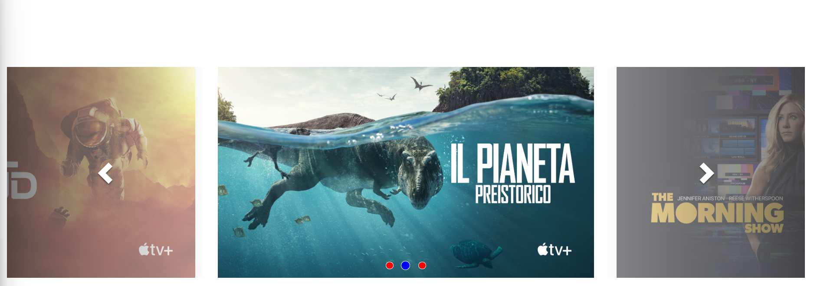

# Apple Website Clone

A simple clone of the Apple website landing page built for practice and learning.




## Technologies

- HTML5
- SCSS (Sass) with Parcel
- Bootstrap 5
- JavaScript

## Getting Started

1. Install dependencies:
   ```bash
   npm install
   ```
2. Start the development server:
   ```bash
   npm run dev
   ```

## Build

```bash
npm run build
```
